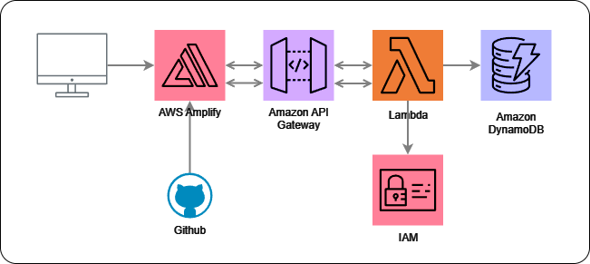

Passos para Configuração
## 1. Criar o Repositório
Crie o repositório no GitHub e clone-o localmente:

```bash
gh repo create sorteioAWS --public --clone
```

Modifique ou crie o arquivo `index.html` no repositório.

## 2. Configurar o AWS Amplify
Adicione o repositório Git criado no AWS Amplify para automação do deploy.

Visite o endereço da aplicação que tem o HTML: `https://master.<abcdefg>.amplifyapp.com/`

## 3. Configurar o DynamoDB
Crie uma nova tabela no DynamoDB. Modifique apenas o nome da tabela e o ID.
Copie o ARN do DynamoDB para uso posterior:

```bash
arn:aws:dynamodb:us-east-1:<AWSnum>:table/SorteiosJornada
```

## 4. Criar a Lambda Function
Utilize o código disponível no arquivo `lambda_code.py` deste repositório.

Acesse a seção de permissões da Lambda e adicione uma nova política de segurança para permitir o acesso ao DynamoDB. Cole o ARN copiado anteriormente na política:

```json
{
    "Version": "2012-10-17",
    "Statement": [
        {
            "Sid": "Statement1",
            "Effect": "Allow",
            "Action": [
                "dynamodb:*"
            ],
            "Resource": [
                "arn:aws:dynamodb:us-east-1:<AWSnum>:table/SorteiosJornada"
            ]
        }
    ]
}
```

## 5. Configurar o API Gateway (Trigger)
- Crie uma REST API no API Gateway.
Configure um método POST e selecione a opção "Método Lambda", vinculando a Lambda Function criada.
- Habilite o CORS para permitir requisições de qualquer origem.
- Faça o deploy da API.